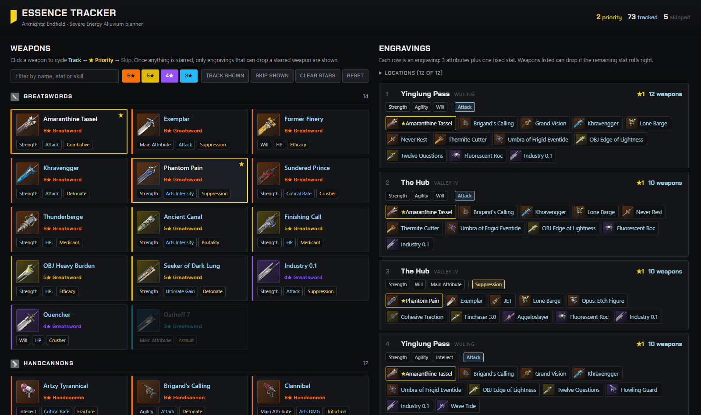
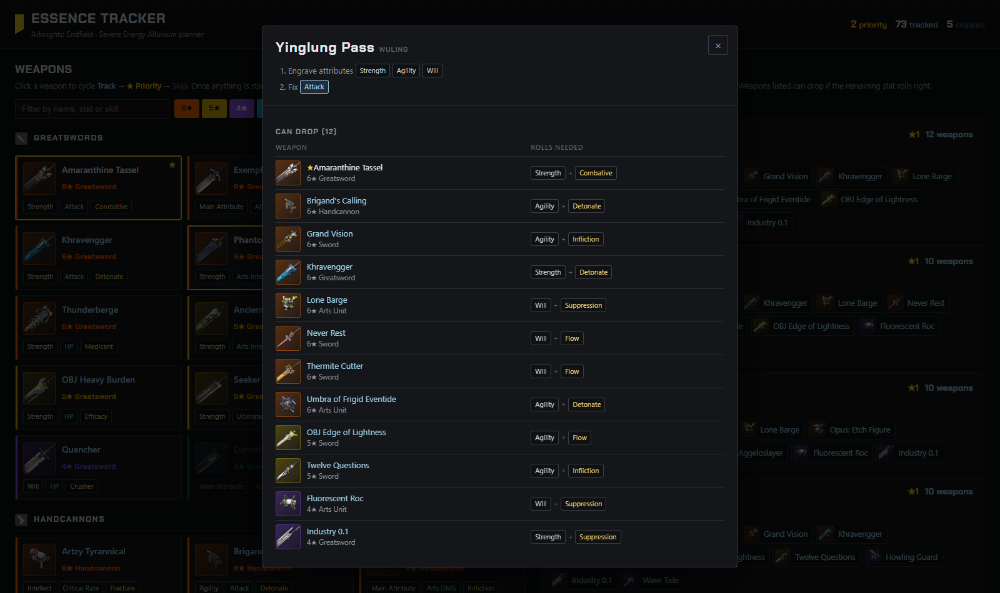

# Arknights: Endfield Essence Tracker

Pick the weapons you want Flawless Essences for, and the tracker lists the Severe Energy Alluvium engravings that can drop the most of them.

**[Open the Essence Tracker](https://nakomaru.github.io/essencetracker/)**

## Preview

### Weapons and engravings


### Engraving details


## How to use
1. Click weapons to cycle **Track** → **★ Priority** → **Skip**. 4–6★ weapons start tracked and 3★ weapons start skipped.
2. The **Engravings** list ranks each location's engravings by how many priority weapons, then tracked weapons, they can drop. Once anything is starred, only engravings that can drop a starred weapon are shown.
3. Each row shows the 3 attributes to engrave and the stat to fix. An **any** slot means every choice there drops the same tracked weapons.
4. Click a row to see, per weapon, which rolls it still needs.
5. Under **Locations**, hide areas you haven't unlocked.

Engravings that only differ in untracked outcomes are merged into one row, and rows that are strictly worse than another row at the same location are dropped.

## Development

The site is plain static files with no build step. Development tooling needs Node 22+ and, for the wiki sync, Python 3.

```sh
npm install          # Playwright, for browser tests and screenshots
npm run serve        # http://127.0.0.1:8000/ (data.json is fetched, so file:// won't work)
npm test             # solver and data tests
npm run test:e2e     # browser tests in the installed Chrome
npm run previews     # regenerate the README screenshots
```

### Updating data
- **Weapons:** `npm run sync` pulls every weapon from the [Endfield Talos Wiki](https://endfield.wiki.gg/wiki/Weapons), updates `data.json` and downloads missing icons. Run `python tools/sync_weapons.py --dry-run` to preview changes. When a weapon is renamed, rename its entry and icon, and list the old name under `formerly` so saved selections carry over.
- **Locations:** edit `alluvium` in `data.json` by hand. The wiki's [Energy Alluvium](https://endfield.wiki.gg/wiki/Energy_Alluvium) page lists each location's skill pool but not its secondary pool; the secondary pools come from game data published by [cmyyx/cep](https://github.com/cmyyx/cep/blob/main/src/data/dungeons.ts).
